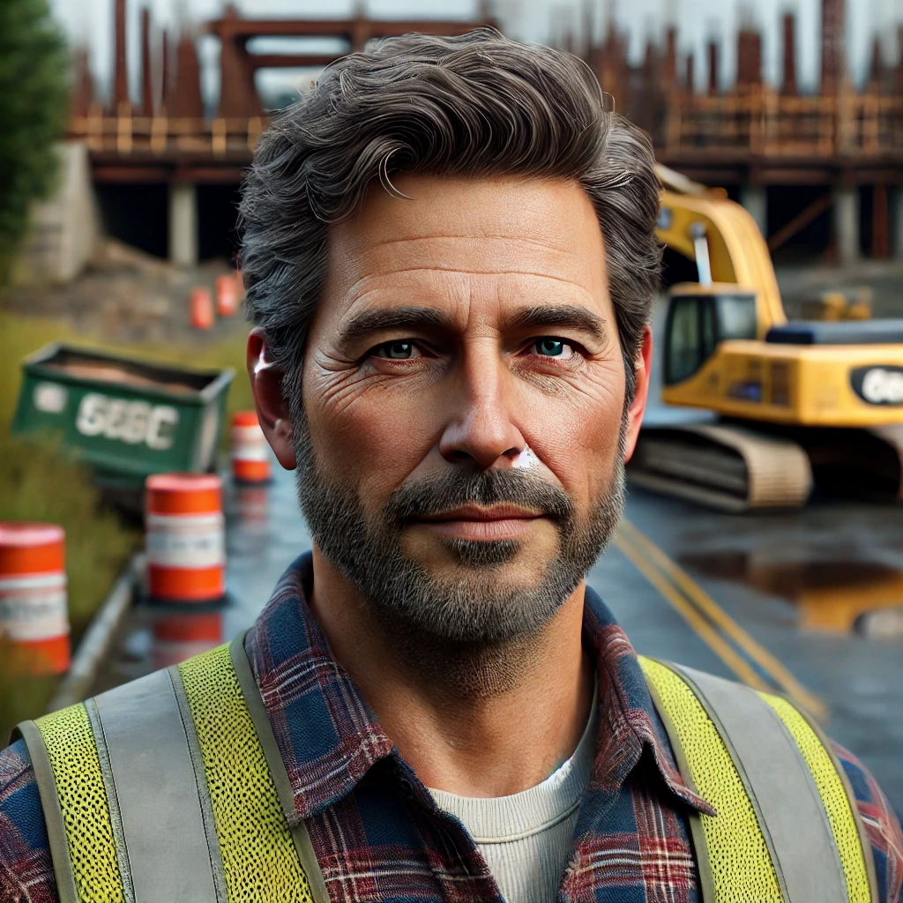
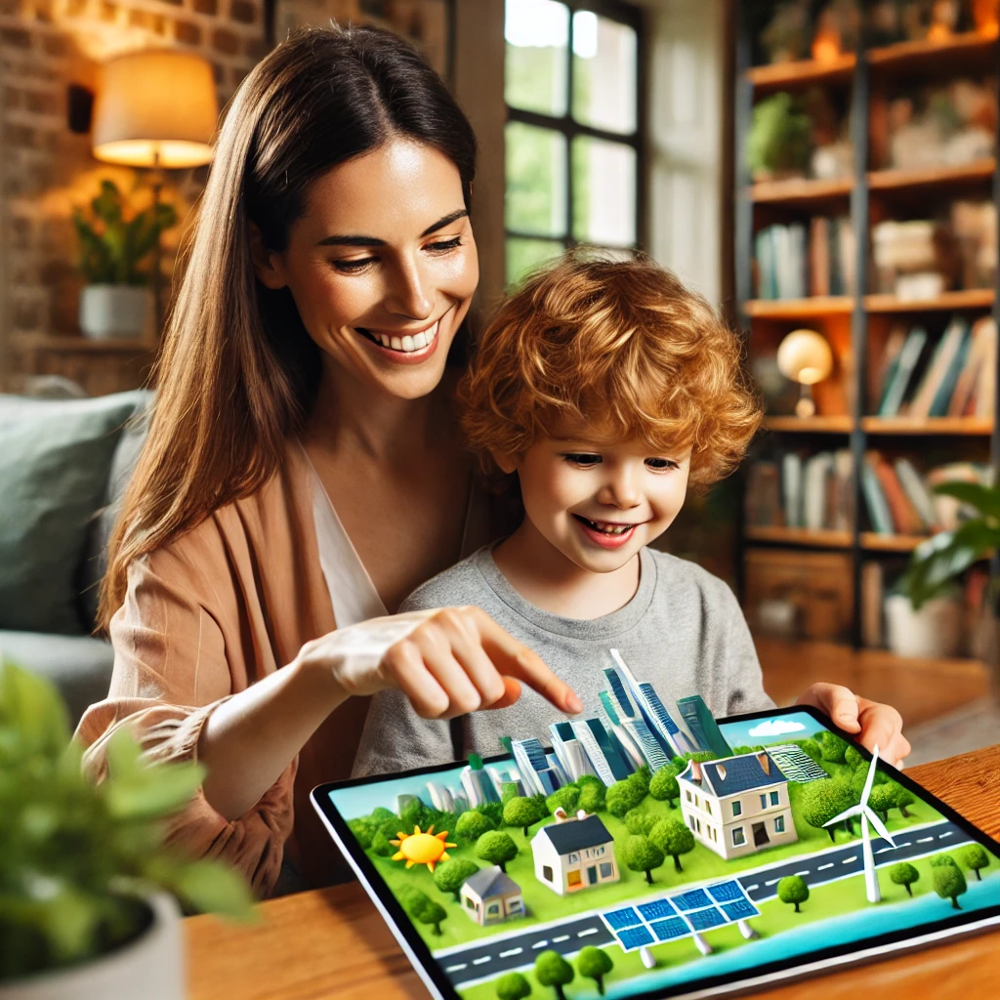
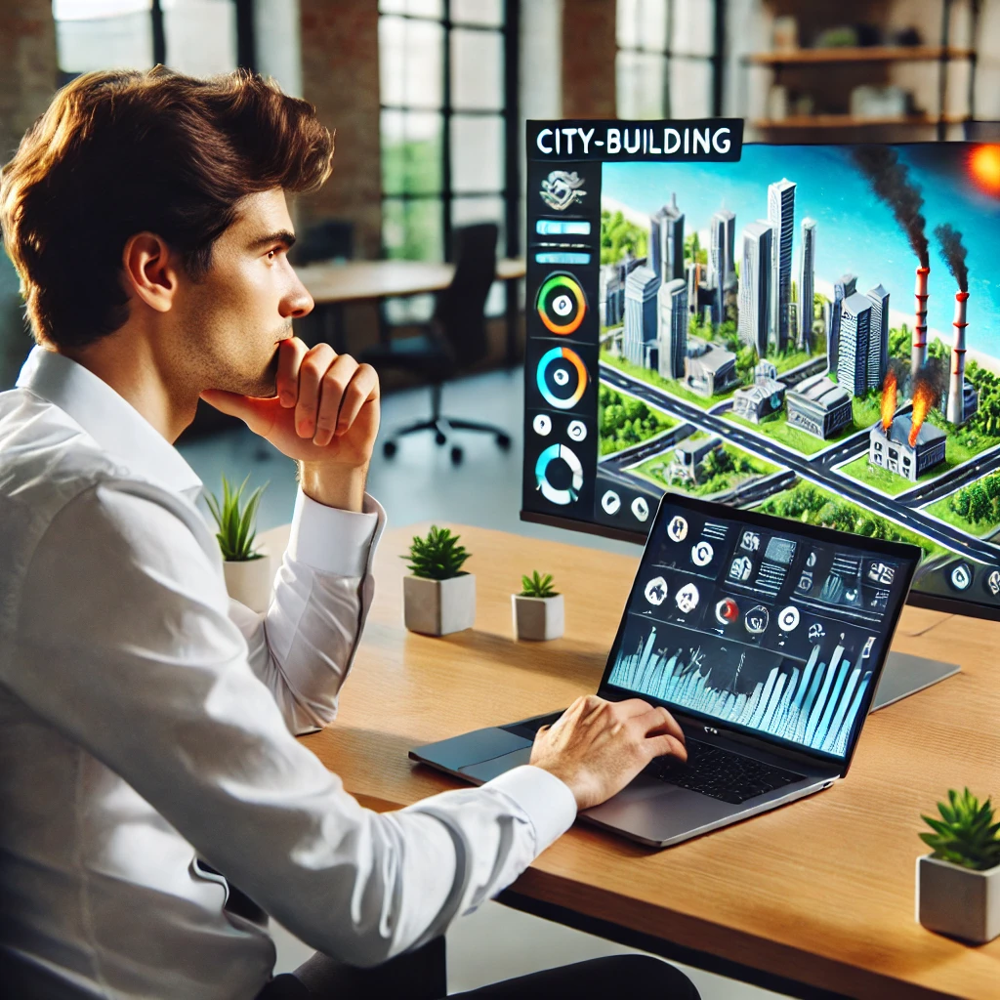
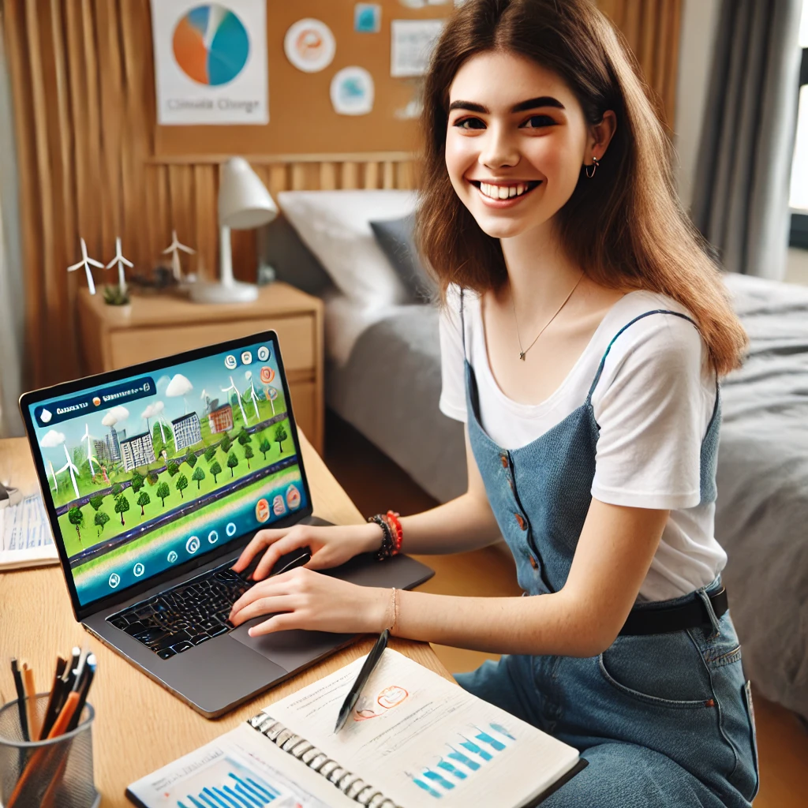
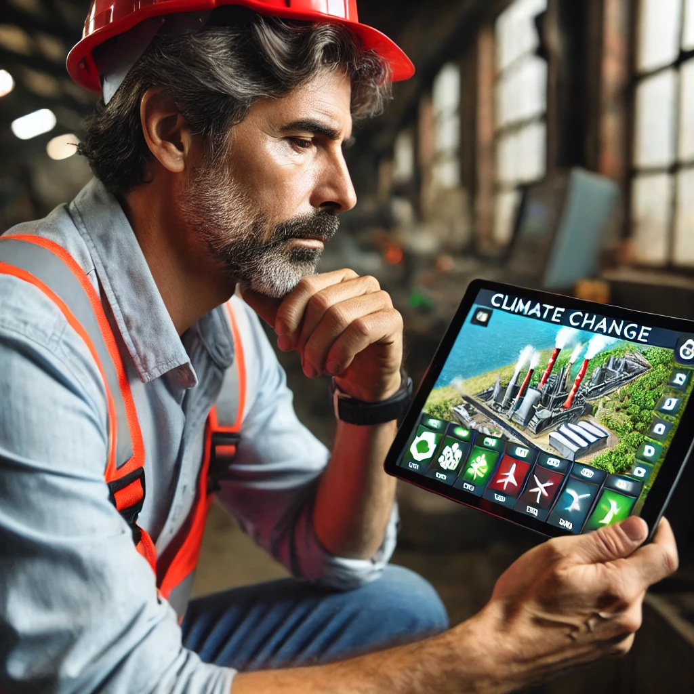
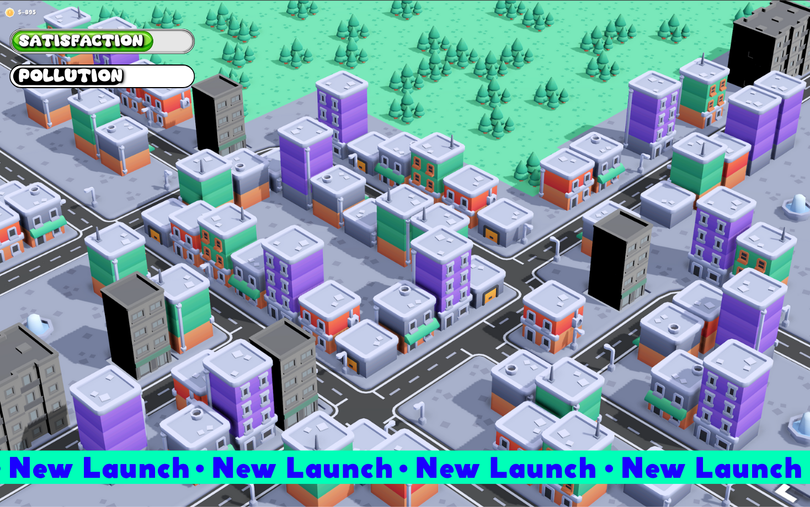
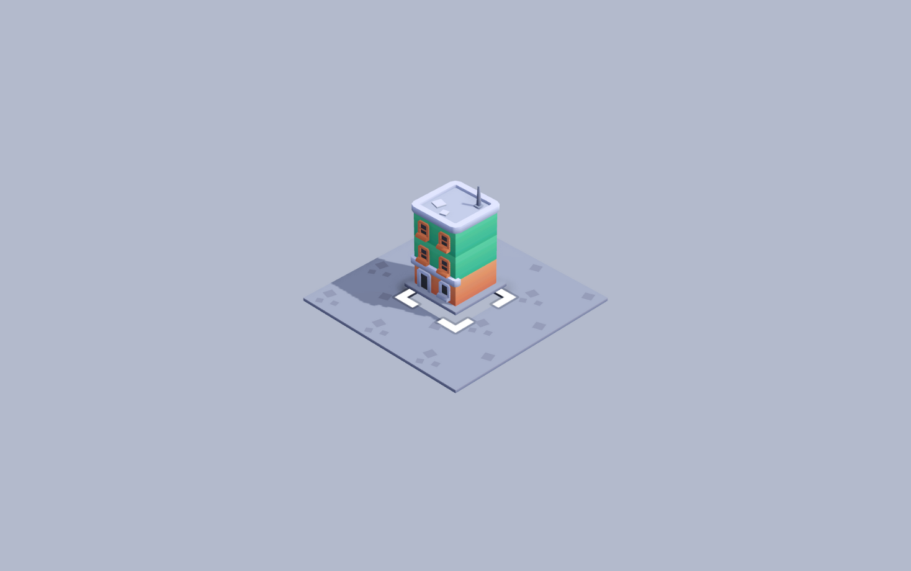
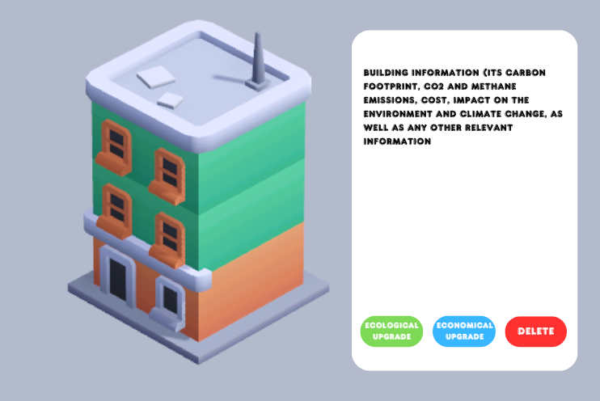

# Green City: Functional Specification Document

## Table of contents

Click to unfold

  - [Team members](#team-members)
  - [I. Introduction](#i-introduction)
  - [II. Personas \& use cases](#ii-personas--use-cases)
    - [Personas](#1-personas)
      - [Persona 1](#a-persona-1-sarah-the-concerned-parent)
      - [Persona 2](#b-persona-2-alex-the-pragmatic-entrepreneur)
      - [Persona 3](#c-ersona-3-leila-the-passionate-student)
      - [Persona 4](#d-persona-4-mark-the-climate-skeptic)
    - [Use cases](#2-use-cases)
      - [Use Case 1](#a-use-case-1-sarah-the-concerned-parent)
      - [Use Case 2](#b-use-case-2-alex-the-pragmatic-entrepreneur)
      - [Use Case 3](#c-use-case-3-leila-the-passionate-student)
      - [Use Case 4](#d-use-case-4-mark-the-climate-skeptic)
  - [III. Goal / scope](#iii-goal--scope)
    - [Primary goal](#1-primary-goal)
    - [Scope of work](#2-scope-of-work)
      - [MVP scope](#a-mvp-scope)
      - [Future vision scope](#b-future-vision-scope)
      - [Priority objectives](#c-priority-objectives)
  - [IV. Functional requirements](#iv-functional-requirements)
    - [Gameplay mechanics](#1-gameplay-mechanics)
      - [MVP functional limits](#a-mvp-functional-limits)
      - [Future vision](#b-future-vision)
    - [UI components](#2-ui-components)
      - [MVP](#a-mvp)
      - [Future vision](#b-future-vision-1)
    - [Player interactions](#3-player-interactions)
      - [MVP](#a-mvp-1)
      - [Future vision](#b-future-vision-2)
  - [V. Dependencies \& priorities](#v-dependencies--priorities)
    - [Feature dependencies and priorities](#1-feature-dependencies-and-prioritiesfeature-dependencies-and-priorities)
      - [Priorities for MVP development](#a-priorities-for-mvp-development)
      - [Priorities for future development](#b-priorities-for-future-development)
  - [VI. Acceptance criteria](#vi-acceptance-criteria)
  - [VII. Design specifications](#vii-design-specifications)
  - [VIII. Non-functional requirements](#viii-non-functional-requirements)
  - [IX. Win / lose conditions](#ix-win--lose-conditions)
    - [Win condition](#1-win-condition)
      - [MVP](#a-mvp-2)
      - [Future vision](#b-future-vision-3)
    - [Lose condition](#2-lose-condition)
      - [MVP](#a-mvp-3)
      - [Future vision](#b-future-vision-4)
  - [X. Impact of management on gameplay](#x-impact-of-management-on-gameplay)
  - [XI. Out of scope](#xi-out-of-scope)
    - [Features Planned for Future Updates](#1-features-planned-for-future-updates)
      - [Future Features and Improvements](#a-future-features-and-improvements)
  - [XII. Security](#xii-security)
  - [XIII. Timeline](#xiii-timeline)
    - [Phase 1](#1-phase-1-research-and-functional-specification-deadline-1122)
    - [Phase 2](#2-phase-2-technical-specification-and-project-setup-deadline-1129)
    - [Phase 3](#3-phase-3-prototype-and-test-planning-deadline-126)
    - [Phase 4](#4-phase-4-mvp-coding-and-iteration-deadline-1213)
    - [Phase 5](#5-phase-5-final-presentation-and-delivery-deadline-1220)
  - [XIV. Localization](#xiv-localization)
    - [Supported languages](#1-supported-languages)
    - [Localization strategy](#2-localization-strategy)
      - [Text externalization](#a-text-externalization)
      - [Font and text formatting](#b-font-and-text-formatting)
      - [Cultural relevance](#c-cultural-relevance)
      - [Voiceovers and audio](#d-voiceovers-and-audio)
    - [Localization tools](#3-localization-tools)
    - [Testing and validation](#4-testing-and-validation)
    - [Future plans](#5-future-plans)
  - [XV. Glossary](#xv-glossary)

## Team members

| Role              | Member name        | Responsibilities                                                              |
| ----------------- | ------------------ | ----------------------------------------------------------------------------- |
| Project manager   | Bistrel Tsangue    | Oversees project progress and ensures deadlines are met.                      |
| Program manager   | Guillaume Deramchi | Manages program implementation, coordinates with stakeholders.                |
| Technical lead    | Lucas Aubard       | Leads the technical direction and supervises the development team.            |
| Software engineer | Victor Leroy       | Develops game features and ensures code quality.                              |
| Software engineer | Manech Laguens     | Implements gameplay mechanics and collaborates on technical tasks.            |
| QA tester         | Habi Cailleau      | Tests the game for bugs and ensures quality standards are met.                |
| Technical writer  | Jason Grosso       | Documents features, creates user guides, and maintains project documentation. |

## I. Introduction

- **Current situation**: "Green City" is an ongoing project aimed at creating an engaging and educational serious game about climate change. Built on [Godot 4.3](#xv-glossary), it leverages game mechanics to simulate urban [sustainability](#xv-glossary) challenges. The project seeks to deliver a polished, professional product that combines education and entertainment.

- **Background**: The game integrates elements of city-building and climate education. Players will face realistic challenges such as transitioning from fossil fuels to [renewable energy](#xv-glossary), managing city resources efficiently, and minimizing carbon emissions. The primary audience includes young adults (ages 15–25), educators in environmental science, and individuals interested in sustainability.

- **Initial MVP focus**: The [MVP](#xv-glossary) will focus on core gameplay, including [resource management](#xv-glossary), [pollution tracking](#xv-glossary), and city-building. The goal is to lay a foundation that can be expanded to achieve the full game vision. The MVP will act as a proof of concept demonstrating key sustainable city-building mechanics, such as balancing energy production with pollution control to maintain a healthy environment while ensuring economic growth.

---

## II. Personas & use cases

### 1. Personas

The following personas represent key player types for Green City:

---

#### a. Persona 1: Sarah, the concerned parent

| **Attribute**        | **Details**                                                                 |
|-----------------------|-----------------------------------------------------------------------------|
|**Image**| |
| **Age**              | 42                                                                          |
| **Occupation**       | Elementary school teacher                                                  |
| **Location**         | Chicago, USA                                                               |
| **Tech-savviness**   | Moderate, uses apps and games occasionally                                |
| **Goals**            | - Teach her children eco-friendly habits.                                   |
|                       | - Learn practical ways to reduce her family's [carbon footprint](#xv-glossary).            |
| **Pain points**      | - Overwhelmed by conflicting information about sustainability.              |
|                       | - Finds most climate education tools too complex or dry.                  |
| **Motivation**       | - Play Green City with her kids as a bonding activity.                      |
|                       | - Discover actionable steps for greener living.                           |

---

#### b. Persona 2: Alex, the pragmatic entrepreneur

| **Attribute**        | **Details**                                                                 |
|-----------------------|-----------------------------------------------------------------------------|
|**Image**|  |
| **Age**              | 35                                                                          |
| **Occupation**       | Owner of a small tech startup                                              |
| **Location**         | Berlin, Germany                                                           |
| **Tech-savviness**   | High, frequently uses digital tools and games for learning                |
| **Goals**            | - Understand how sustainability impacts business growth.                   |
|                       | - Learn innovative strategies for reducing energy costs.                  |
| **Pain points**      | - Struggles to balance profit and environmental responsibility.             |
|                       | - Feels climate change discussions are often too idealistic.              |
| **Motivation**       | - Explore practical solutions to energy and waste management.              |
|                       | - Simulate real-world decision-making in a fun environment.              |

---

#### c. Persona 3: Leila, the passionate student

| **Attribute**        | **Details**                                                                 |
|-----------------------|-----------------------------------------------------------------------------|
|**Image**|  |
| **Age**              | 19                                                                          |
| **Occupation**       | Environmental science major                                               |
| **Location**         | Rabat, Morocco                                                            |
| **Tech-savviness**   | Intermediate, uses technology for research and casual gaming              |
| **Goals**            | - Gain deeper insights into how cities contribute to climate change.        |
|                       | - Use knowledge from Green City for her studies and activism.              |
| **Pain points**      | - Finds traditional academic tools uninspiring.                            |
|                       | - Wants engaging ways to learn while having fun.                          |
| **Motivation**       | - Test strategies for reducing urban emissions in a risk-free environment.  |
|                       | - Advocate for sustainability using lessons from the game.               |

---

#### d. Persona 4: Mark, the climate skeptic

| **Attribute**        | **Details**                                                                 |
|-----------------------|-----------------------------------------------------------------------------|
|**Image**|  |
| **Age**              | 50                                                                          |
| **Occupation**       | Construction manager                                                      |
| **Location**         | Houston, USA                                                              |
| **Tech-savviness**   | Low, mostly uses technology for work-related purposes                     |
| **Goals**            | - Prove that concerns about climate change are exaggerated.                |
|                       | - Understand the game’s perspective on environmental issues.              |
| **Pain points**      | - Believes climate change data is often biased or alarmist.                |
|                       | - Prefers practical, measurable solutions over theoretical debates.       |
| **Motivation**       | - Challenge his views through gameplay scenarios.                          |
|                       | - See if the game’s mechanics reflect his perspective of economic growth. |

---

### 2. Use cases

The following use cases illustrate how different personas interact with Green City:

---

#### a. Use Case 1: Sarah, the concerned parent

| **Attribute**        | **Details**                                                                 |
|-----------------------|-----------------------------------------------------------------------------|
|**Image**|  |
| **Goal**             | Teach her children about eco-friendly habits in an interactive way.         |
| **Steps**            | 1. Sarah starts a new game with her 10-year-old child. |
|                       | 2. Together, they build a small city, starting with renewable energy sources like solar panels. |
|                       | 3. They encounter scenarios such as a budget deficit, where they must choose between cheaper fossil fuels or maintaining green energy. |
|                       | 4. They explore pollution indicators, watching how decisions like adding a park reduce smog and improve city health. |
|                       | 5. The game provides feedback on how these choices relate to real-world climate impacts. |
| **Outcome**          | - Sarah and her child learn about the importance of renewable energy and urban greenery. |
|                       | - The game sparks conversations about practical eco-friendly steps they can take at home. |

---

#### b. Use Case 2: Alex, the pragmatic entrepreneur

| **Attribute**        | **Details**                                                                 |
|-----------------------|-----------------------------------------------------------------------------|
|**Image**|  |
| **Goal**             | Explore strategies for balancing business growth with sustainability.       |
| **Steps**            | 1. Alex starts the game. |
|                       | 2. He prioritizes building industrial zones to generate revenue for his city but quickly sees pollution levels rise. |
|                       | 3. To mitigate this, Alex invests in green technology upgrades for factories and introduces a recycling program. |
|                       | 4. He experiments with policies such as carbon taxes and public awareness campaigns to balance growth and emissions. |
|                       | 5. Through trial and error, Alex optimizes his city’s financial and environmental health. |
| **Outcome**          | - Alex gains insights into the challenges of implementing green policies in a business environment. |
|                       | - He discovers how small investments in sustainability can lead to long-term economic benefits. |

---

#### c. Use Case 3: Leila, the passionate student

| **Attribute**        | **Details**                                                                 |
|-----------------------|-----------------------------------------------------------------------------|
|**Image**|  |
| **Goal**             | Understand the impact of urban planning decisions on climate change for her environmental science project. |
| **Steps**            | 1. Leila starts the game. |
|                       | 2. She builds a city focused on renewable energy, including solar farms and wind turbines, to minimize emissions. |
|                       | 3. She uses the carbon meter to track how urban sprawl and energy choices increase the city’s emissions. |
|                       | 4. When a scenario introduces severe weather due to climate change, she learns about the importance of mitigation strategies like tree planting and improved public transit. |
|                       | 5. Leila uses the game’s data-driven feedback to write a detailed report for her class project. |
| **Outcome**          | - Leila deepens her understanding of climate systems and their connection to urban development. |
|                       | - She uses screenshots and in-game data to support her academic presentation. |

---

#### d. Use Case 4: Mark, the climate skeptic

| **Attribute**        | **Details**                                                                 |
|-----------------------|-----------------------------------------------------------------------------|
|**Image**|  |
| **Goal**             | Test the validity of climate change claims through gameplay.                |
| **Steps**            | 1. Mark plays the game on "Beginner" difficulty, skeptical of its premise.  |
|                       | 2. He initially ignores renewable energy options, relying solely on coal and oil to minimize costs and maximize city expansion. |
|                       | 3. As pollution levels rise, he sees the game introduce visible consequences like smog, health warnings, and citizen dissatisfaction. |
|                       | 4. Curious, he tries introducing green policies like solar energy and public transit to test their impact. |
|                       | 5. He compares the financial trade-offs and benefits, finding that sustainable policies eventually lead to a balanced budget and improved citizen satisfaction. |
| **Outcome**          | - Mark gains a clearer understanding of the economic and social costs of pollution. |
|                       | - While not fully convinced, he acknowledges the benefits of renewable energy and efficient resource management. |

---

## III. Goal / scope

### 1. Primary goal

 The primary goal is to develop a game that simulates environmental challenges to educate young adults and students on climate change, sustainability, carbon footprint. Players must balance economic development with sustainable practices, making choices that prioritize long-term environmental health. Players will need to decide whether to build industrial facilities that boost the economy but increase pollution. Alternatively, they can invest in renewable energy sources, which cost more initially but lead to long-term sustainability.

### 2. Scope of work

#### a. MVP scope

- **Resource management**: Players allocate renewable (e.g., solar energy) and non-renewable (e.g., fossil fuel) resources while managing the city’s finances.
- **Pollution tracking**: Pollution levels will be visually represented to show the city's health and the impact of player decisions over time.
- **Educational feedback**: Visual feedback (pollution indicators, health bars) helps players understand the consequences of their actions.
- **Simple decision-making**: Players make straightforward decisions regarding renewable energy, waste management, and city expansion.

#### b. Future vision scope

- **Advanced resource management**: Introduce more complex resource types (e.g., food, advanced energy systems).
- **Pollution mitigation**: Advanced tools to reduce pollution, like tree planting, public transit, and waste management systems.
- **Complex decision-making**: Balancing industrial growth, environmental sustainability, and citizen satisfaction.

#### c. Priority objectives

- **Promote renewable energy**: Encourage players to prioritize renewable energy to minimize the carbon footprint.
- **Emphasize waste management**: Highlight managing waste through recycling, composting, and waste-to-energy plants.
- **Foster public awareness**: Include public campaigns to raise awareness about sustainability.

- **Game complexity**: The game will be simple to grasp, with intuitive mechanics suitable for all ages. The MVP will focus on core features like resource allocation and pollution tracking, while future versions will expand these features for more depth.

- **Target outcomes**:

  - Players understand the importance of balancing city growth with sustainable practices.
  - Players learn the impact of resource choices on pollution, quality of life, and growth.
  - Players develop a sense of responsibility regarding environmental impacts.

## IV. Functional requirements

### 1. Gameplay mechanics

#### a. MVP functional limits

To ensure focused development and avoid scope creep, the following functional limits are established for the MVP:

- **City size**: Players can build a city with up to **30 buildings** (e.g., residential, commercial, industrial, and parks). Once a building is placed, it is possible to remove it but it will consume energy, inciting players to be careful about smart building placement.
- **Resource types**: The MVP includes only **two energy types**: renewable (solar energy) and non-renewable (fossil fuels). Advanced energy systems (e.g., nuclear, wind turbines) will not be implemented in the MVP.
- **Pollution tracking**: Pollution is measured using a **single [pollution bar](#xv-glossary)** ranging from 0% (clean) to 100% (critical).
- **Win/Lose conditions**: Pollution and energy management are the only criteria for winning or losing. No population satisfaction or other secondary metrics will be included.
- **UI components**: The dashboard displays **energy consumption, pollution levels, and financial status** only. Advanced visual indicators (e.g., trend graphs, detailed notifications) are excluded.

#### b. Future vision

- **[Building upgrades](#xv-glossary)**: Players upgrade buildings to improve efficiency (e.g., reducing energy consumption).
- **[Dynamic pollution control](#xv-glossary)**: Advanced tools like public transit and green technologies reduce pollution levels.

### 2. UI components

#### a. MVP

- **Simple dashboard**: Displays essential metrics like energy consumption, financial status, and pollution levels. A news ticker-like banner will be displayed on the main screen, displaying random facts about climate change, which will be rolling through the screen.

#### b. Future vision

- **Detailed notifications**: Prompts and messages guide players through complex decisions.
- **Advanced visual indicators**: Charts and graphs provide comprehensive feedback (e.g., pollution trends, energy usage over time).

### 3. Player interactions

#### a. MVP

- **Construction**: Players place and remove basic buildings.
- **Basic decision-making**: Players decide on energy use, construction, and waste management.
- **[Feedback mechanisms](#xv-glossary)**: Visual cues (e.g., changes in city aesthetics) help players understand their impact.

#### b. Future vision

- **Advanced construction**: Players upgrade buildings for increased efficiency.
- **Complex decision-making**: Players balance economic growth, environmental health, and citizen satisfaction.
- **Enhanced feedback**: Audio cues and detailed notifications provide deeper insights.

## V. Dependencies & priorities

### 1. Feature dependencies and priorities

#### a. Priorities for MVP development

The following features are categorized by their priority level for the MVP:

**High priority** (must-have):
- Basic building placement for 5 structure types: residential, industrial, commercial, parks, and energy plants.
- Pollution tracking via a simple visual bar.
- Resource allocation for renewable and [non-renewable energy](#xv-glossary).
- Basic win/lose conditions based on pollution and energy levels.

**Medium priority** (nice-to-have):
- UI enhancements, such as hover tooltips for buildings.
- Simple tutorial for new players.
- Expanded pollution indicators, such as changing colors in the city layout.

**Low priority** (optional for MVP):
- Dynamic pollution control (e.g., introducing green spaces).
- Detailed visual feedback, such as graphs or animations.

#### b. Priorities for future development

To guide future updates, the following features are prioritized based on their potential impact, development complexity, and alignment with the game's goals:

**High priority** (post-MVP must-have):
- **Dynamic pollution control**: Introduce tools like tree planting, waste recycling, and public transit to allow players to actively mitigate pollution.
- **Building upgrades**: Enable upgrading buildings to increase efficiency and reduce resource consumption.
- **[Population metrics](#xv-glossary)**: Add a population satisfaction meter influenced by pollution, resource allocation, and city infrastructure.

**Medium priority** (post-MVP nice-to-have):
- **Advanced energy options**: Expand energy types to include wind turbines, geothermal, and nuclear power plants.
- **Random events**: Introduce [dynamic challenges](#xv-glossary) such as extreme weather events or economic downturns.

**Low priority** (optional for future updates):
- **Multiplayer mode**: Enable competitive or cooperative gameplay for up to four players.
- **Aesthetic enhancements**: Add visual and sound design elements to improve immersion, such as detailed animations or custom city designs.

## VI. Acceptance criteria

- **Gameplay verification**:

  - Players can place buildings, allocate resources, and track pollution.
  - Players achieve varying levels of success based on management of resources and pollution.

- **User interface**:

  - **MVP**: The UI must be intuitive, with responsive elements like buttons and dashboards.
  - **Future vision**: The UI must provide advanced feedback and clear indicators.

- **Educational content**:

  - Players receive relevant information about environmental impacts.

## VII. Design specifications

- **UI layout**: Mockups or design prototypes should illustrate MVP and future UI versions. The MVP should have a clean layout focusing on ease of navigation.

- **UX elements**: The user experience should prioritize accessibility and engagement. The MVP will offer a linear flow, while the future version may include branching decisions and tutorials.

### 1. Mockups and screenshots

Here are some mockups of what the game should be looking like, using Canva and the Starter Kit City Builder from Kenney Assets:

**How the overall game should look like:**  

---

**Here is an example of the moment before placing a building:**

---

**Here is how the contextual menu should look like when you click on a building (ecological upgrade, economical upgrade, destroy, and information about the building and how it affects our environment):**

---

## VIII. Non-functional requirements

- **Performance**: Ensure the game runs smoothly at 60 FPS on mid-range devices.

- **[Scalability](#xv-glossary)**: The game must handle large-scale city data without issues. The MVP introduces base data management, while future versions implement optimizations.

- **Accessibility**: Adjustable text sizes, colorblind-friendly palettes, and simplified UI modes for younger audiences or those with impairments.

## IX. Win / lose conditions

### 1. Win condition:

#### a. MVP

- Players win by maintaining pollution levels below a defined threshold and providing enough renewable energy for five in-game years. This indicates that the city has successfully achieved sustainable growth.

#### b. Future vision

- Players achieve milestones in sustainable growth, public awareness, and resource efficiency.

### 2. Lose condition:

#### a. MVP

- Players lose if pollution exceeds a critical threshold for more than one in-game year, leading to city collapse.

#### b. Future vision

- Players lose due to resource depletion, public dissatisfaction, or financial collapse.

## X. Impact of management on gameplay

- **Good management**:
  - **Steady growth**: Players receive more income for further development, similar to how cities with strong policies on renewable energy and efficient infrastructure see economic growth over time.
  - **Positive feedback**: The city becomes greener, with visual indicators of progress, much like how cities that invest in public parks and green spaces often see improved quality of life.

- **Poor management**:
  - **Deterioration**: Rising pollution levels lead to resource scarcity and visible degradation, similar to cities experiencing severe smog and environmental decline due to poor regulations.
  - **Negative feedback**: Pollution indicators, such as smog, increase, showing declining sustainability, much like how poor urban planning can lead to visible pollution and declining living conditions.
  - **Citizen dissatisfaction**: Reduced productivity, abandoned buildings, and city decline, similar to urban decay seen in cities that fail to manage resources effectively.

## XI. Out of scope

### 1. Features Planned for Future Updates

#### a. Future Features and Improvements

The following features are **not included in the MVP** but are planned for future updates to expand the game’s depth:

- **Population metrics**: Adding a population satisfaction meter based on city pollution, resource allocation, and available services.
- **Dynamic pollution Control**: Implementing tools like tree planting, waste recycling, and public transit systems.
- **Building upgrades**: Allowing players to upgrade existing structures to increase efficiency and reduce resource consumption.
- **Advanced energy options**: Expanding energy types to include wind turbines, geothermal, and nuclear power plants.
- **Random events**: Introducing unexpected challenges like extreme weather events or economic downturns to increase replayability.
- **Multiplayer mode**: Enabling competitive or cooperative gameplay for up to four players.

These features will be prioritized based on player feedback and available resources following the MVP release.

## XII. Security

- **Data security**: Implement data protection protocols. All saved data must be secure to prevent unauthorized access. Specific measures include data encryption (e.g., AES-256) for all stored player data, secure communication channels (e.g., HTTPS), and regular security audits to identify vulnerabilities.

- **[Authentication](#xv-glossary)**: Outline player identification mechanisms if needed, such as profile creation or save encryption. Multi-factor authentication (MFA) may also be considered for added security.

## XIII. Timeline

### 1. Phase 1: Research and functional specification _(Deadline: 11/22)_

- **Deliverables:**
  - Identify core educational objectives for the game.
  - Research scientific data on climate change and urban sustainability to inform gameplay mechanics.
  - Develop the functional specification document, detailing the game's features and use cases.
- **Outcome:** A finalized functional specification document that establishes the foundation for the project.

---

### 2. Phase 2: Technical specification and project setup _(Deadline: 11/29)_

- **Deliverables:**
  - Write the technical specification document, defining the architecture and technical requirements.
  - Set up the Godot 4.3 project repository and integrate assets from the Starter Kit.
  - Establish workflows for coding, testing, and asset integration.
- **Outcome:** A comprehensive technical specification document and a fully initialized project environment.

---

### 3. Phase 3: Prototype and test planning _(Deadline: 12/6)_

- **Deliverables:**
  - Develop the basic game loop with placeholder assets.
  - Implement initial gameplay mechanics, including building placement and resource tracking.
  - Draft the test plan, outlining scenarios, test cases, and acceptance criteria.
- **Outcome:** A functional prototype and a detailed test plan for validating the game.

---

### 4. Phase 4: MVP coding and iteration _(Deadline: 12/13)_

- **Deliverables:**
  - Implement core gameplay mechanics, including pollution tracking and educational feedback.
  - Integrate assets from Kenney’s library for visual consistency.
  - Conduct iterative testing to resolve bugs and refine the user experience.
  - Develop the user manual, covering gameplay, mechanics, and educational content.
- **Outcome:** A polished MVP with core functionality, supporting documentation, and an optimized user experience.

---

### 5. Phase 5: Final presentation and delivery _(Deadline: 12/20)_

- **Deliverables:**
  - Conduct comprehensive QA testing to ensure stability and usability.
  - Prepare a professional presentation showcasing the game’s educational objectives and gameplay features.
  - Deliver a live demo highlighting the game’s mechanics and educational impact.
  - Submit all final deliverables, including code, documentation, and testing results.
- **Outcome:** A completed game, ready for stakeholder evaluation and presentation.

---

## XIV. Localization

### 1. Supported languages

The game will initially support English only for the MVP:

Future updates may include additional languages based on player demographics and demand, such as French, Spanish, German, or Arabic.

### 2. Localization strategy 

The following steps outline the localization strategy for the future version of "Green City":

#### a. Text externalization

- All in-game text, including dialogues, menus, and tooltips, will be stored in external resource files (e.g., JSON, CSV, or PO files). This ensures that translations can be easily added or updated without modifying the codebase.

#### b. Font and text formatting

- Fonts that support multiple character sets, such as Latin, Cyrillic, and Arabic scripts, will be used to ensure compatibility across languages.
- Text alignment and formatting will dynamically adapt to account for differences in word length and reading direction (e.g., right-to-left for Arabic).

#### c. Cultural relevance

- Icons, symbols, and examples will be reviewed to ensure they are culturally neutral and globally relatable.
- Environmental scenarios (e.g., renewable energy solutions) will include options relevant to different regions, such as solar power in sunny climates or wind turbines in coastal regions.

#### d. Voiceovers and audio

- If voiceovers are added in future versions, localized voice acting will be implemented. For the MVP, text-based subtitles will suffice.

### 3. Localization tools

To streamline the localization process, the following tools will be considered:

- **Crowdin** or **POEditor**: For collaborative translation management.
- **Godot's built-in localization system**: For handling multiple language files and dynamic text loading.

### 4. Testing and validation

Before releasing localized versions, the following will be tested:

- Text rendering and alignment for all supported languages.
- Consistency and accuracy of translations.
- User feedback to ensure translations are culturally and contextually appropriate.

### 5. Future plans

In future updates, localization may also include:

- Regional-specific tutorials or examples (e.g., explaining carbon offset programs common in Europe).
- Dynamic adaptation to local metrics (e.g., Celsius/Fahrenheit for temperature, kilometers/miles for distance).
- Broader language support based on user feedback and analytics.

## XV. Glossary

- **Godot**: An open-source game engine used for 2D and 3D game development (source: [Wikipedia](https://en.wikipedia.org/wiki/Godot_(game_engine))).[↩ Back to Introduction](#i-introduction)

- **Sustainability**: The ability to maintain ecological balance by avoiding the depletion of natural resources (source: [Wikipedia](https://en.wikipedia.org/wiki/Sustainability)).[↩ Back to Introduction](#i-introduction)

- **Renewable energy**: Energy derived from natural processes that are replenished at a faster rate than they are consumed, such as solar and wind energy (source: [Wikipedia](https://en.wikipedia.org/wiki/Renewable_energy)).[↩ Back to Introduction](#i-introduction)

- **Carbon footprint**: The total amount of greenhouse gases (GHG) generated by human actions, expressed as carbon dioxide equivalent (CO2e) (source: [Wikipedia](https://en.wikipedia.org/wiki/Carbon_footprint)).[↩ Back to Introduction](#i-introduction)

- **MVP (minimum viable product)**: A product version with the minimum features necessary to test an idea and attract early adopters for feedback (source: [Wikipedia](https://en.wikipedia.org/wiki/Minimum_viable_product)).[↩ Back to Introduction](#i-introduction)

- **Resource management**: The process of efficiently allocating resources such as energy and materials within the game to achieve goals (source: [Wikipedia](https://en.wikipedia.org/wiki/Resource_management)).[↩ Back to Introduction](#i-introduction)

- **Pollution tracking**: Monitoring and visual representation of pollution levels in the game to show the impact of player decisions (source: [Wikipedia](https://en.wikipedia.org/wiki/Pollution)).[↩ Back to Introduction](#i-introduction)

- **Educational feedback**: Insights provided to players about the consequences of their actions, aiming to educate on sustainability principles (source: [Wikipedia](https://en.wikipedia.org/wiki/Educational_game)).[↩ Back to Goal / scope](#iii-goal--scope)

- **Pollution bar**: A visual indicator in the game that represents the city’s overall pollution levels, ranging from 0% (clean) to 100% (critical) (source: [Wikipedia](https://en.wikipedia.org/wiki/Pollution)).[↩ Back to Functional requirements](#iv-functional-requirements)

- **Building upgrades**: Improvements players can apply to existing structures to increase efficiency, reduce resource consumption, or mitigate pollution (source: [Wikipedia](https://en.wikipedia.org/wiki/Building_upgrade)).[↩ Back to Functional requirements](#iv-functional-requirements)

- **Dynamic pollution control**: In-game tools and methods to actively manage and reduce pollution levels, such as public transit or advanced green technologies (source: [Wikipedia](https://en.wikipedia.org/wiki/Pollution_control)).[↩ Back to Functional requirements](#iv-functional-requirements)

- **Feedback mechanisms**: Tools and indicators that help players understand the immediate and long-term impact of their decisions (source: [Wikipedia](https://en.wikipedia.org/wiki/Feedback_mechanism)).[↩ Back to Functional requirements](#iv-functional-requirements)

- **Non-renewable energy**: Energy sourced from finite resources like fossil fuels (coal, oil, natural gas) that emit greenhouse gases when consumed (source: [Wikipedia](https://en.wikipedia.org/wiki/Non-renewable_energy)).[↩ Back to Dependencies & priorities](##v-dependencies--priorities)

- **Population metrics**: Indicators that measure citizen satisfaction based on pollution levels, resource availability, and city infrastructure (source: [Wikipedia](https://en.wikipedia.org/wiki/Quality_of_life)).[↩ Back to Dependencies & priorities](##v-dependencies--priorities)

- **Dynamic challenges**: Unpredictable events such as severe weather or economic crises that test the player’s adaptability and decision-making skills.[↩ Back to Dependencies & priorities](##v-dependencies--priorities)

- **Scalability**: The ability of the game to handle increasing complexity or larger datasets without performance degradation (source: [Wikipedia](https://en.wikipedia.org/wiki/Scalability)).[↩ Back to Non-functional requirements](#viiI-non-functional-requirements)

- **Authentication**: Mechanisms to verify player identity, which may include profile creation or encryption to secure game progress (source: [Wikipedia](https://en.wikipedia.org/wiki/Authentication)).[↩ Back to Security](#xii-security)
